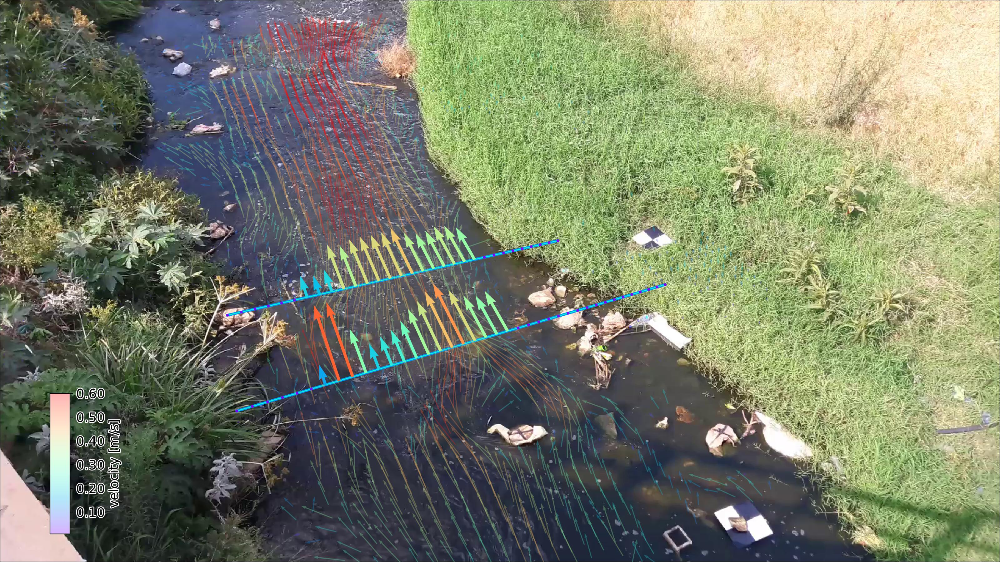

.. pyOpenRiverCam documentation master file, created by
   sphinx-quickstart on Fri Nov 19 15:06:11 2021.
   You can adapt this file completely to your liking, but it should at least
   contain the root `toctree` directive.

.. _index_page:

==========================================
Welcome to pyOpenRiverCam's documentation!
==========================================

**pyorc**, short for "pyOpenRiverCam" is a fully Open Source program for performing image-based river flow analysis.
It is the underlying library for computations on the fully open software stack OpenRiverCam. **pyorc** can only be
successful if the underlying methods are made available openly for all. Currently **pyorc** implements Large-scale
Particle Image Velocimetry (LSPIV) based flow analysis using the OpenPIV library and reprojections and image
pre-processing with OpenCV. We wish to extend this to Large-scale Particle Tracking Velocimetry (LSPTV) and Space-Time
Image Velocimetry (STIV) for conditions that are less favourable for LSPIV using open libraries or extensions to this
code.

Image: Example of pyorc velocimetry over Ngwerere river at the Zambezi Road crossing - Lusaka, Zambia.

For whom?
=========
**pyorc** is a Command-line program and a very well documented "Application Programming Interface" (API) in the
well-known computer language python. It performs the full processing chain from your field work collected videos and
control points to fully processed, and visualized results. Example users are:

- Water managers, geospatial service providers, drone operators, hydrometrists, environmental resources managers, and so
  on who wish to process their video data in a simple to use python platform and workflow.
- Programmers who wish to establish their own applications, graphical interfaces, dashboards or other applications on
  top of the API.
- Researchers wishing to have a fully integrated and open-source tool chain to kick start their research in optical
  hydraulic flow observations, having the liberty to publish their *entire* research, including the processing methods.
- Developers who wish to further develop methods along with the core development team of **pyorc**.

Capabilities
============

Current capabilities are:

* Reading of frames and reprojection to surface
* Velocimetry estimation at user-defined resolution
* Discharge estimation over provided cross-section
* Plotting of velocimetry results and cross-section flows in camera, geographical and orthoprojected perspectives.

We use the well-known xarray_ data models and computation pipelines (with dask) throughout the entire library to
guarantee an easy interoperability with other tools and methods, and allow for lazy computing. The outputs are all
in the well-known NetCDF format.

Support us
==========
We are seeking funding for the following frequently requested functionalities:

* Exports to simple text formats and GIS-compatible layers
* Compiled windows executables
* Implementation of better filtering in pre-processing
* Improved efficiency of processing (e.g. through GPU/TPU acceleration)
* Establishing on-site edge computation through a raspberry-pi camera setup
* Implementation of additional processing algorithms (STIV and LSPTV)
* Establishment of dashboard environments for several use cases

Please contact us at info@rainbowsensing.com for further information.

.. note::

   **pyorc** has been created by the `Local Devices <https://localdevices.org>`_ consortium to support local people,
   with local devices and software to monitor their environment. If you like **pyorc**, require additional
   functionalities or want to contact us for other work or ideas, please email info@rainbowsensing.com

.. note::

   Acknowledgement: the development of **pyorc** has been funded partly by the World Meteorological Organisation,
   Rijkswaterstaat and in-kind contributions of `Rainbow Sensing <https://rainbowsensing.com>`_.

.. toctree::
   :maxdepth: 1
   :hidden:
   :caption: Table of Contents

   intro
   installation
   user-guide/index.rst
   quickstart
   api.rst

.. _xarray: https://docs.xarray.dev/
