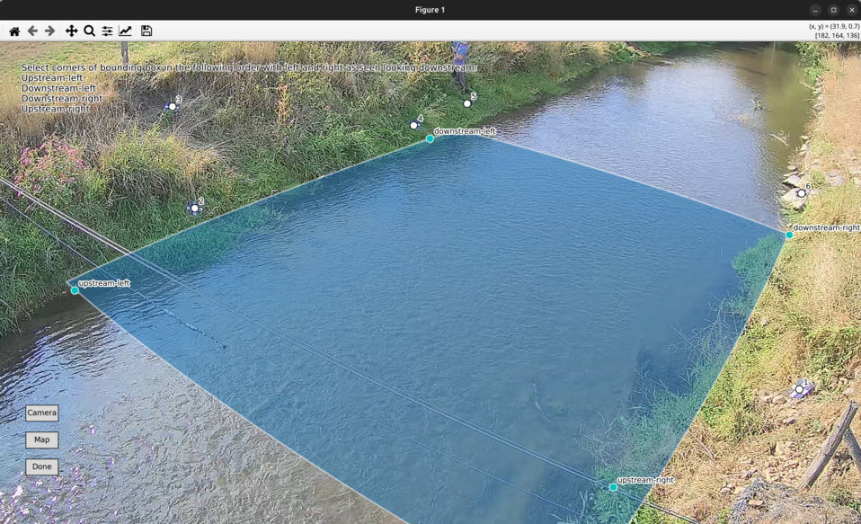

.. _camera_config_cli_bbox:

In the command-line interface there are two options to establish a bounding box to the camera configuration:

* use the option ``--corners`` and supply a JSON-formatted list of 4 column, row pairs, similar to the approach
  used for supplying ``--src``.
* use an interactive point-and-click view to click the points into your camera objective.

The ``--corners`` options works in exactly the same way as ``--src``. *pyorc* uses the 4 corners to draw a geographical
best-fitting rectangular box automatically and add this to the camera configuration.

As said before, choosing these corner points may be something you wish to try out a few times to get it right.
Moreover, selecting them would also require a photo editor, and cumbersome noting down of coordinates and this can also
easily be prone to errors where you accidentally swap row or column, or accidentally supply data in the wrong order.
Similar to the ``--src`` case, you can also simply leave out ``--corners`` and then *pyorc* will ask if you wish to
interactively supply the corner points. Simply choose ``Y`` for yes, and you will again get an interactive view.
This view will show the earlier chosen ``--src`` points in the *Camera* view, and (if you click on *Map*) the ``-dst``
points in the *Map* view. Once you start selecting corners points in the *Camera* view, the view will show you which
of the 4 points you have selected (e.g. the first point would read as "upstream left-bank". COntinue until you have
clicked 4 points, and then you will see the allocated bounding box around the 4 points. If you then click on *Map*
you will see the same bounding box in geographical space. If you wish to improve your corner point selection, then
simply use right-click to remove points and select new locations for them to change the bounding box. Once you are
satisfied, click on *Done* and the bounding box will be stored in the camera configuration.

Below an example of the bounding box as it appears in the interactive interface is shown.

