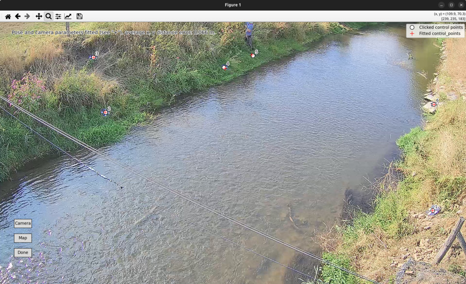

.. _camera_config_cli_gcps:

There are several approaches to provide ground control point information to the camera configuration through the
command-line interface:

* supply information with optional arguments as strings
* supply information embedded in vector GIS files such as shapefiles
* supply information interactively through (dependent on which information) a user-prompt or a visual interactive
  view.

For the first option, JSON-formatted strings are used. JSON is a standard format to provide information in string format
such as simple text, floating point numbers, integer numbers, but also more complex dictionaries, or lists. In our case
we only need floating point numbers to provide ``z_0`` and ``h_ref``, list of lists for ``src`` and ``dst`` and an
integer or string for ``--crs_gcps`` (i.e. the crs in which the destination locations of ground control points are
measured). Remember that ``--crs_gcps`` can be supplied through e.g. an EPSG code, which is an integer number, but also
in a "Well-known Text" (wkt) form, which is a string.

.. note::

    In JSON format, a list can be supplied using comma separated numbers, encapsulated by square brackets "[" and "]".

For our example video, supplying the gcps in a full command-line option manner would be done as follows:

.. code-block:: shell

    $ pyorc camera-config --crs_gcps 32735 --src "[[1421, 1001], [1251, 460], [421, 432], [470, 607]]" --dst "[[642735.8076, 8304292.1190], [642737.5823, 8304295.593], [642732.7864, 8304298.4250], [642732.6705, 8304296.8580]]" --z_0 1182.2 --h_ref 0.0 ......

At the end of this command, after the ``.....`` more inputs such as the video with control points, the CRS of the camera
configuration, and the output filename must be presented. With this input, no further interaction with the user to
complete the control points is required.

In many cases though, the information under ``-dst`` may be cumbersome to insert. Hence a more convenient option is to
leave out ``-dst`` and replace it for ``--shapefile`` and provide a path to a shapefile or other vector formatted
GIS file containing your real-world control points. *pyorc* assumes that the shapefile contains exactly those points you
wish to use, no more and no less, that all information is in the geometries (i.e. x, y and if +6-points are used, also z) and
that the file contains a CRS that allows for automated reprojection to the CRS of the camera configuration (i.e.
supplied with ``--crs``). The geometries MUST be of the type POINT only! *pyorc* will attempt to indicate any
problems with shapefiles that contain wrong or incomplete information so that you can resolve that if needed.

.. note::

    If you use a RTK GNSS, a typical output is a shapefile containing points, a CRS and geometries with x, y and z
    coordinates. If your output file contains more points than your control points, then first edit the file in a
    GIS program such as |qgis| and delete any points that do not belong to ground control points.

Similarly, the information contained in ``--src`` may also be very cumbersome to collect. In fact, you need to open up
a frame in a photo editor and note down rows and columns to do so. Therefore a much more and highly recommended
approach is to simply leave out ``-src`` entirely. You will then be asked if you want to interactively select these
points. Simply select `Y` and use our convenient point and click approach to select the control points. To make sure you
click them in the right order, you can click on the *Map* button to display a map overview of the situation. Here, your
``--dst`` points (or points collected from the shapefile) will be displayed in a map view, with numbers indicating
which point should be selected first, which second and so on. You can go back to the camera view with the *camera*
button. Then you simply click on the first, second, third, ... and so on control point to collect all control points.
Did you make an accidental click on a random point? No problem: just right-click and the last point you clicked
will be removed. Right-click again and the point before that is removed so that you can click again.

Once all point are clicked, *pyorc* will optimize both the perspective and the camera's lens characteristics
simultaneously, and display the points you clicked, but then projected using the camera matrix, distortion coefficients
and the estimated perspective pose of the camera. You will see the result as red "+" signs on the screen and an average
error in meters displayed on the top of the frame. If the average error is larger than 0.1 meter you will get a warning.
Large errors are likely due to poorly measured control points, or because you clicked the points in the wrong order.

Once the optimization is performed, the *Done* button will become clickable. Click *Done* to close the view and store
the points in the camera configuration. If you made a mistake and want to rectify poorly clicked points, simply right
click as many times as needed to remove points, and add them again with left clicks. The optimization will be repeated
again once you have reached the total amount of control points. The view after the optimization is shown in the example
below.

.. note::

    Especially with large objectives and high resolution footage (e.g. 4K), it may be hard to accurately click or even
    see the control points. In this case, we highly recommend to use the zoom and pan functionality on the top bar of
    the interactive view. The Home button will bring you back to the original view.

.. |qgis| raw:: html

   <a href="https://qgis.org/" target="_blank">QGIS</a>
