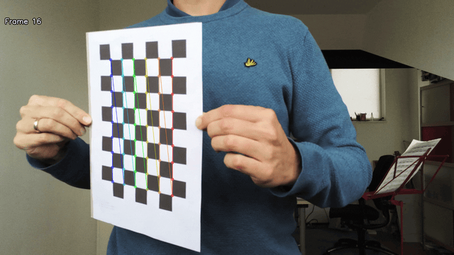
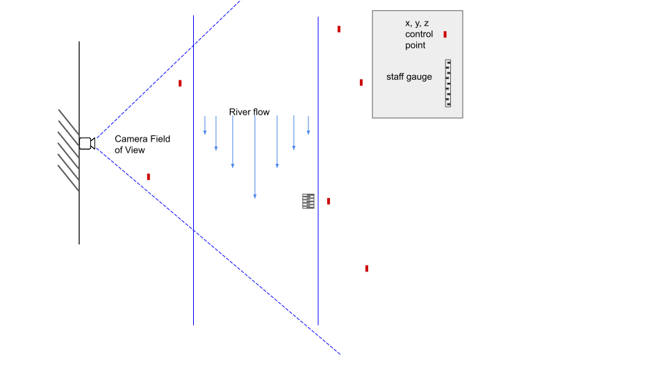
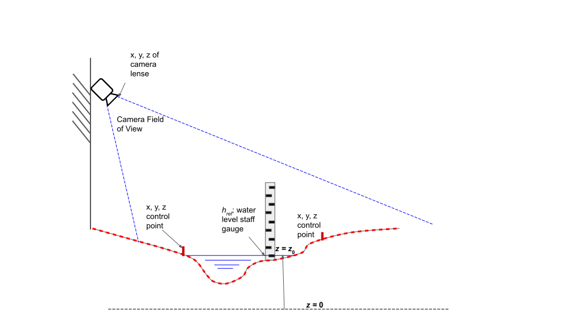

.. _camera_config_ug:

Camera configurations
=====================

An essential element in doing optical velocity estimates is understanding how the Field Of View (FOV) of a camera
relates to the real-world coordinates. This is needed so that a camera's FOV can be "orthorectified", meaning it can
be transposed to real-world coordinates with equal pixel distances in meters. For this we need understanding of the
lens characteristics, and understanding of where a pixel (2-dimensional with column and row coordinates, a.k.a.
image coordinates) is located in the real world (3-dimensional, a.k.a. geographical coordinates).
The camera configuration methods of **pyorc** are meant for this purpose.

Setting up a camera configuration
---------------------------------

.. tab-set::

    .. tab-item:: Command-line

        .. include:: ./cli.rst

    .. tab-item:: API

        .. include:: ./api.rst

Making the camera configuration geographically aware
----------------------------------------------------

In case you are able to perform your field measurements with a RTK GNSS device, then your camera configuration
can be made entirely geographically aware. You can then export or visualize your results in a geographical map later
on, or use your results in GIS software such as QGIS. You do this simply by passing the keyword ``crs`` (or ``--crs``
on command line) to the camera configuration and enter a projection. Several ways to pass a projection are possible such as:

* EPSG codes (see EPSG.io)
* proj4 strings
* Well-Know-Text format strings (WKT)

Because **pyorc** intends to measure velocities in distance metrics, it is compulsory to select a locally valid meter
projected coordinate reference system, and not for instance an ellipsoidal coordinate system such as the typical
WGS84 latitude longitude CRS. For instance in the Netherlands you may use Rijksdriehoek (EPSG code 28992). In Zambia
the UTM35S projection (EPSG code 32735) is appropriate, whilst in Tanzania, we may select the UTM37S projection (EPSG code
32737). IF you use a non-appropriate or non-local system, you may get either very wrong results, or get errors during
the process. To find a locally relevant system, we strongly recommend to visit the `EPSG site <https://epsg.io>`_ and
search for your location. If you do not have RTK GNSS, then simply skip this step and ensure you make your own local
coordinate system, with unit meter distances.

Once your camera configuration is geographically aware, we can pass all other geographical information we may need in
any projection, as long as we notify the camera configuration which projection that is. For instance, if we measure
our ground control points (GCPs, see later in this manual) with an RTK GNSS set, and store our results as WGS84 lat-lon
points, then we do not have to go through the trouble of converting these points into the system we chose for our camera
configuration. Instead we just pass the CRS of the WGS84 lat-lon (e.g. using the EPSG code 4326) while we add the GCPs
to our configuration. We will see this later in this manual.

.. tab-set::

    .. tab-item:: Command-line

        .. include:: ./cli_geo.rst

    .. tab-item:: API

        .. include:: ./api_geo.rst

.. note::

   A smart phone also has a GNSS chipset, however, this is by far not accurate enough to provide the measurements needed
   for **pyorc**. We recommend using a (ideal!) RTK GNSS device with a base station setup close enough to warrant
   accurate results, or otherwise a total station or spirit level. Highly affordable GNSS kits with base and rover
   stations are available through e.g. ardusimple_.

Camera intrinsic matrix and distortion coefficients
---------------------------------------------------
An essential component to relate the FOV to the real world is the camera's *intrinsic* parameters, i.e. parameters
that define the dimensions and characteristics of the used camera lens and its possible distortion. As an example, a
smartphone camera has a very flat lens, with a short focal distance. This often results in the fact that objects or
people at the edges of the field of view seem stretched, while the middle is quite reliable as is.
With a simple transformation, such distortions can be corrected.
Fish eye lenses, which are very popular in trail cameras, IP cameras and extreme sport cameras, are constructed to
increase the field of view at the expense of so-called radial distortions. With such lenses, straight lines may become
distorted into bend lines in your objective. Imagine that this happens with a video you wish to use for velocimetry,
then your geographical referencing can easily be very wrong (even in the order of meters with wide enough streams)
if you do not properly account for these. If for example your real-world coordinates are measured somewhere in the
middle of the FOV, then velocities at the edges are likely to be overestimated.

.. note::

    In *pyorc* the focal distance is automatically optimized based on your real-world coordinates, provided as ground
    control points. This is done already if you provide 4 control points in one vertical plane (e.g. at the water level).
    In case you provide 6 or more ground control points with varying vertical levels, then *pyorc* will also attempt to
    optimize the radial distortion. Therefore we strongly recommend that you measure 6 or more control points in case
    you use a lens with significant radial distortion.

You can also provide a camera intrinsic matrix and distortion coefficients in the API if you have these, or optimize
the intrinsic matrix and distortion coefficients using a checkerboard pattern. More on this is described below.

Preparing a video for camera calibration
~~~~~~~~~~~~~~~~~~~~~~~~~~~~~~~~~~~~~~~~

We have a method available to manually establish an intrinsic matrix and distortion coefficients. It reads in a video in
which a user shows a chessboard pattern and holds it in front of the camera in many different poses and at as many
different locations in the field of view as possible. It then strips frames in a staggered manner starting with the
first and last frame, and then the middle frame, and then the two frames in between the first, last and middle, and so
on, until a satisfactory number of frames have been found in which the chessboard pattern was found. The intrinsic
matrix and distortion coefficients are then calculated based on the results, and added to the camera configuration.

.. note::

   Making a video of a chessboard pattern and calibrating on it is only useful if you do it the right way. Take care
   of the following guidelines:

   * ensure that the printed chessboard is carefully fixed or glued to a hard object, like a strong straight piece of
     cardboard or a piece of wood. Otherwise, the pattern may look wobbly and cause incorrect calibration
   * a larger chessboard pattern (e.g. A0 printed) shown at a larger distance may give better results because the
     focal length is more similar to field conditions. An A4 printed pattern is too small. Using *pyorc*'s built-in
     calibration is then more trustworthy.
   * make sure that while navigating you cover all degrees of freedom. This means you should move the checkerboard
     from top to bottom and left to right; in all positions, rotate the board around its horizontal and vertical
     middle line; and rotate it clockwise.
   * make sure you record the video in exactly the same resolution and zoom level as you intend to use during the
     taking of the videos in the field.

  If the calibration process is not carefully followed it may do more harm than good!!! Therefore, if you are unsure
  then we strongly recommend simply relying on the built-in automated calibration.

An example of extracts from a calibration video with found corner points is shown below (with A4 printed chessboard so
not reliable for a field deployment, this is only an example). It gives an impression of how you can move the chessboard
pattern around. As said above, it is better to print a (much!) larger chessboard and show that to the camera at a larger
distance.

Lens calibration method
~~~~~~~~~~~~~~~~~~~~~~~

.. tab-set::

    .. tab-item:: Command-line

        .. note::

            At the moment, manual lens calibration is only available at API level. If you require a command-line option
            for lens calibration, then please contact us at info@rainbowsensing.com.

    .. tab-item:: API

        .. include:: ./api_lens_calib.rst

Ground control points
---------------------
Besides the characterization of the lens used for taking the video, we must also characterise the camera to real-world
coordinate system. In other words: we must know where a row and column in our camera perspective may lie in the real
world. Naturally, this is a poorly defined problem as your camera's perspective can only be 2D, whilst the real world
has 3 dimensions. However, our problem is such that we can always fix one dimension, i.e. the elevation. If we already
know and fix the level of the water (z-coordinate), then we can interpret the remaining x-, and y-coordinates if we
give the camera calibration enough information to interpret the perspective. We do this by providing so-called ground
control points, that are visible in the FOV, and of which we know the real-world coordinates.

ground control point information and abbreviations
~~~~~~~~~~~~~~~~~~~~~~~~~~~~~~~~~~~~~~~~~~~~~~~~~~

Within *pyorc*, both the command-line inteface and API, the different components of your ground control points are
represented by abbreviated variables. These have the following meaning:

* ``src`` contains [column, row] locations of the control points in the FOV.
* ``dst``: contains [x, y] locations (in case you use 4 control points on one vertical plane) or [x, y, z] locations (
  in case you use 6 control points with arbitrary elevation).
* ``z_0``: water level measured in the vertical reference of your measuring device (e.g. RTK GNSS)
* ``h_ref``: water level as measured by a local measurement device such as a staff gauge
* ``crs``: the CRS in which the control points are measured. This can be different from the CRS of the camera
  configuration itself in which case the control points are automatically transformed to the CRS of the camera
  configuration. If left empty, then it is assumed the CRS of the measured points and the camera configuration is the
  same.

Measuring the GCP information
-----------------------------

Below we describe how the information needed should be measured in the field during a dedicated survey. This is
typically done every time when you do an incidental observation, or once during the installation of a fixed camera.
If you leave the camera in place, you can remove recognizeable control points after the survey, as long as you have
one video with the control points visible, which you can use to setup the camera configuration.

Example of survey situations
~~~~~~~~~~~~~~~~~~~~~~~~~~~~

You will notice in the next sections that you can typically measure either 4 control points at one vertical plane
(e.g. the water surface) or 6 or more points at random elevations. You prepare this situation by spreading easy to
recognize markers over your Field of View. In the figure below you see two examples, one where 4 sticks were placed in
the water and the interface of the sticks with the water (red dots) is measured. And one where 6 black-and-white
markers are spread over the field of view.

.. table:: Examples of ground control markers and situations

    +----------------------------------------------------------------------------------------------------------------+
    | 4 GCPt at water surface - Chuo Kikuu River, Dar es Salaam, Tanzania                                            |
    +----------------------------------------------------------------------------------------------------------------+
    | |gcps_4|                                                                                                       |
    +----------------------------------------------------------------------------------------------------------------+
    |  6 (+) GCPs spread over banks and FOV - Geul River, Limburg, The Netherlands                                   |
    +----------------------------------------------------------------------------------------------------------------+
    | |gcps_6|                                                                                                       |
    +----------------------------------------------------------------------------------------------------------------+

The schematic below shows in a planar view what the situation looks like. It is important that the control points are
nicely spread over the Field of View, and this is actually more important than an equal spread of points of left and
right bank. In the schematic we show this by having only 2 control points at the bank close to the camera, and 4 at
the opposite side. If you have your camera on a bridge in the middle of the bridge deck, then having 3 (or more) points
left as well as right makes the most sense. The better the spread is, the more accurate the perspective will be
resolved.

   Planar schematic view of site survey situation.

Ensuring that the vertical plane is fully understood is also important.
The ``z_0`` and ``h_ref`` optional keys are meant to allow a user to provide multiple videos with different water
levels. If you intend to do this, you may install a water level measuring device on-site such as a staff gauge or
pressure gauge, that has its own vertical zero-level reference. Therefore, to use this option the following should be
measured and entered:

* measure the water level during the survey with your local device (e.g. staff gauge) and insert this in ``h_ref``
* also measure the water level with your survey device such as total station or RTK GPS, i.e. using the exact same
  vertical reference as your control points. This has its own vertical zero level. This level must be inserted in
  ``z_0``. Any other surveyed properties such as the lens position and the river cross section must also be measured
  with the same horizontal and vertical coordinate system as ``z_0`` and the ground control points.

The overview of these measurement requirements is also provided in the schematic below.

   Cross-section schematic view of site survey situation.

Entering control points in the camera configuration
~~~~~~~~~~~~~~~~~~~~~~~~~~~~~~~~~~~~~~~~~~~~~~~~~~~

.. tab-set::

    .. tab-item:: Command-line

        .. include:: ./cli_gcps.rst

    .. tab-item:: API

        .. include:: ./api_gcps.rst

Setting the lens position
-------------------------

If you also provide a lens position, then this position will be used along-side the ground control points to better
optimize the pose estimation and to better estimate the focal length. Similar to the control points, we advise to
measure the location as accurately as possible, and naturally in exactly the same horizontal and vertical datum as the
control points.

.. tab-set::

    .. tab-item:: Command-line

        The position of the lens can be supplied with a simple list of [x, y, z] coordinate, provided within
        quotes ("). It will be assumed that these coordinates share the same CRS as the ground control points. Hence if
        you provide ``--crs_gcps`` or provide a shapefile with ``--shapefile`` that has a CRS embedded, then this CRS
        will also be applied on the lens position. An example of how to supply the lens position with a pseudo-command
        is provided below.

        .. code-block:: shell

            pyorc camera-config ... --lens_position "[642732.6705, 8304289.010, 1188.5]" ... OUTPUT.json

    .. tab-item:: API

        The lens position can be provided using a simple method ``set_lens_position``. You only
        need to provide x, y, z and the CRS (if this is different from the CRS of the camera configuration itself.

        A full example supplying the lens position to the existing ``cam_config`` is shown below:

        .. code-block:: python

            # cam_config object is already defined in earlier code blocks
            lens_position = [6.0478872, 49.8830221, 309.8]  # lon, lat, elevation position of the camera
            cam_config.set_lens_position(*lens_position, crs=4326)

Setting the area of interest
----------------------------
**pyorc** is organized such that it processes a planar rectangular shaped area as shown in the example below
over the Wark River in Luxembourg. The results of reprojection and velocity estimation will all fit in this
area of interest in the form of raster maps. **pyorc** is also very flexible in the rotation of the grid. River sections
almost never follow an ideal north-south or east-west direction, and therefore it is much more practical to allow
for a rotated grid. This sounds complicated, but the great thing about *pyorc* is that you only have to supply 4 points
in the camera Field of View and then *pyorc* will interpret for you where these 4 points lie in geographical space
and which rectangular bounding box fits best around these points. In case there is a very clear dominant flow direction
then we recommend to supply the corners points in a very specific order namely (see from the perspective looking
in downstream direction):

* upstream left-bank
* downstream left-bank
* downstream right-bank
* upstream right-bank

Masking steps in *pyorc* where unreliable velocities are masked out can then also remove velocities that are in an
unexpected direction more easily, and without tuning of masking parameters.

.. image:: ../../_images/wark_cam_config.jpg

.. tab-set::

    .. tab-item:: Command-line

        .. include:: ./cli_bbox.rst

    .. tab-item:: API

        .. include:: ./api_bbox.rst

Stabilization
-------------
You can decide whether videos must be stabilized. *pyorc* needs to be able to find so-called "rigid points" to do this.
Rigid points are points that do not move during the video. *pyorc* can automatically detect easy stable points to track
and then follow how these move from frame to frame. As the points should not move, *pyorc* will then transform each
frame so that the resulting movements are minimized. To ensure the transformation are really rigid, such regid points
must be found on all edges of the video. Hence it is important that when you take an unstable video, that there is
enough visibility of surrounding banks, or infrastructure or other stable elements around the video to perform the
stabilization. If such objects are only found in e.g. one half or (worse) one quadrant of the video, then the
stabilization may give very strange results in the areas where no rigid points are found. Therefore, only use this
if you know quite certainly that stable points will be found in many regions around the water.

For stabilization, *pyorc* requires a polygon that defines the area where no rigid points are expected. This is
essentially the moving water and possibly also strongly moving vegetation if this is present in the frame. So select
the polygon such that it encompasses both water and other strongly moving elements as much as possible.

.. tab-set::

    .. tab-item:: Command-line

        On the command line, simply provide ``--stabilize`` or ``-s`` as additional argument and you will be provided
        with a interactive point and click view on your selected frame. You may click as many points as you wih to
        create a polygon that encompasses moving things. To ensure that you include all edges, you can also pan
        the frame so that areas outside of the frame become visible. Select the 4th button from the left (two crossed
        double-arrows) to select panning. Click on the most left (Home) button to return to the original view.

    .. tab-item:: API

        For stabilization, provide ``stabilize`` as additional argument to ``CameraConfig`` and provide as value
        a list of lists of coordinates in [column, row] format, similar to ``gcps["src"]``.

Result of a camera configuration
--------------------------------

Once you have all your settings and details complete, the camera configuration can be stored, plotted and later
used for processing videos into velocimetry.

.. tab-set::

    .. tab-item:: Command-line

        When all required parameters are provided, the resulting camera configuration will be stored in a file
        set as ``<OUTPUT>`` on the command line. If you have our code base and the ``examples`` folder, then you can for
        instance try the following to get a camera configuration without any interactive user inputs required:

        .. code-block:: console

            $ cd examples/ngwerere
            $ pyorc camera-config -V ngwerere_20191103.mp4 --crs 32735 --z_0 1182.2 --h_ref 0.0 --lens_position "[642732.6705, 8304289.010, 1188.5]" --resolution 0.03 --window_size 15 --shapefile ngwerere_gcps.geojson --src "[[1421, 1001], [1251, 460], [421, 432], [470, 607]]" -vvv ngwerere_cam_config.json

        This will use the video file ``ngwerere_20191103.mp4``, make a camera configuration in the CRS with EPSG number
        32735 (UTM Zone 35 South), with measured water level at 1182.2, and reference water level at 0.0 meter (i.e.
        we only treat one video). The lens position, set as coordinates in UTM35S is set as an [x, y, z] coordinate,
        resolution used for reprojection is set at 0.03 meter, with a window size for cross-correlation set at 15 pixels.
        The destination control points are provided in a file ``ngwerere_gcps.geojson`` and the source coordinates
        are provided as a list with [column, row] coordinates in the frame object. Finally, corner points to set the
        bounding box are provided as a list of [column, row] coordinates as well. The configuration is stored in
        ``ngwerere_cam_config.json``. If you leave out the ``--src`` and ``--corners`` components, you will be able to
        select these interactively as shown before. You can also add ``--stabilize`` to also provide a region for
        stabilization as described before. Also the ``--h_ref`` and ``--z_0`` values can be supplied
        interactively on the command line.

        The command-line interface will also automatically store visualizations of the resulting camera configuration
        in both planar view (with a satellite background if a CRS has been used) and in the camera perspective. The file
        names for this have the same name as <OUTPUT> but with the suffixes ``_geo.jpg`` for the planar view and
        ``_cam.jpg`` for the camera FOV perspective.

    .. tab-item:: API

        Storing a camera configuration within the API is as simple as calling ``to_file``. Camera configurations can
        also be loaded back in memory using ``pyorc.load_camera_config``.

        .. code-block:: python

            # cam_config was generated before from our examples/ngwerere folder
            import pyorc
            cam_config.to_file("ngwerere_cam_config.json")
            # load the configuration back in memory
            cam_config2 = pyorc.load_camera_config("ngwerere_cam_config.json")

        When a full camera configuration is available, you can access and inspect several properties and access a few other
        methods that may be useful if you wish to program around the API. We refer to the :ref:`API documentation <cameraconfig>`.

        We highly recommend to first inspect your camera configuration graphically, before doing any further work with it.
        Examples have already been shown throughout this manual, but you can also plot your own camera configurations, either
        in planar view, or in the original camera FOV. For this the ``plot`` method has been developed. This method can
        always be applied on an existing matplotlib axes object, by supplying the ``ax`` keyword and referring the the axes
        object you wish to use.

        Planar plotting is done by default. The most simple approach is:

        .. code-block:: python

            cam_config.plot()

        This will yield just the camera configuration information, and can always be used, whether you have a geographically
        aware camera configuration (CRS provided) or not. If the camera configuration is geographically aware, then you
        can also add a satellite or other open map as a background. **pyorc** uses the ``cartopy`` package to do this. You can
        control this with the ``tiles`` keyword to define a tiles layer (see `this page <https://scitools.org.uk/cartopy/docs/v0.16/cartopy/io/img_tiles.html>`_)

        Additional keywords you may want to pass to the tiles set can be defined in the keyword ``tiles_kwargs``. Finally, the
        zoom level applied can be given in the keyword ``zoom_level``. By default, a very high zoom level (18) is chosen,
        because mostly, areas of interest cover only a small geographical region. The geographical view shown above can be
        displayed as follows:

        .. code-block:: python

            cam_config.plot(tiles="GoogleTiles", tiles_kwargs=dict(style="satellite"))

        To plot in the camera FOV, simply set ``camera=True``.

        .. code-block:: python

            cam_config.plot(camera=True)

        This may look a little awkward, because plotting in matplotlib is defaulting to having the 0, 0 point in the bottom left
        while your camera images have it at the top-left. Furthermore, you cannot really interpret what the FOV looks like. Hence
        it makes more sense to utilize one frame from an actual video to enhance the plotting. Here we use the video on which
        the camera configuration is based, extract one frame, and plot it within one axes.

        .. code-block:: python

            fn = r"20220507_122801.mp4"
            video = pyorc.Video(fn, camera_config=cam_config, start_frame=0, end_frame=1)

            # get the first frame as a simple numpy array
            frame = video.get_frame(0, method="rgb")
            # combine everything in axes object "ax"
            ax = plt.axes()
            ax.imshow(frame)
            cam_config.plot(ax=ax, camera=True)

.. |gcps_4| image:: ../../_images/ChuoKikuu_GCPs.jpg

.. |gcps_6| image:: ../../_images/Geul_GCPs.jpg

.. _ardusimple: https://ardusimple.com/

.. _QGIS: https://qgis.org/