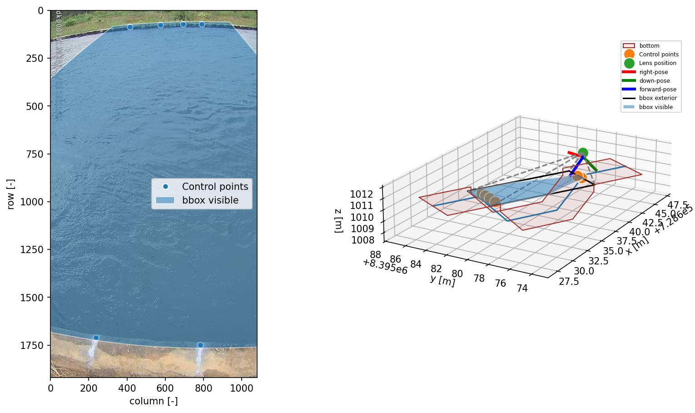
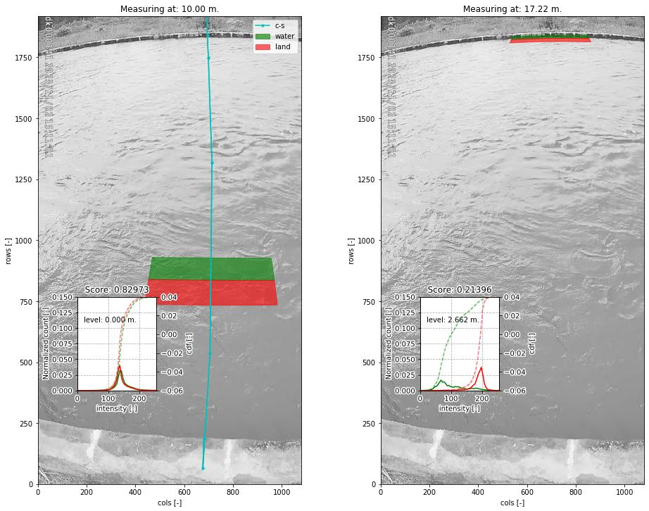
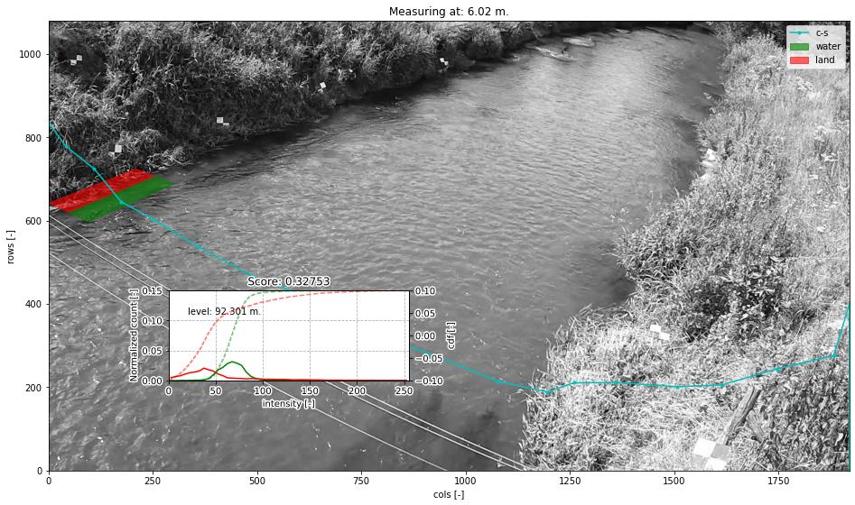

.. _cross_section_ug:

Cross Sections and water level detection
========================================

Cross sections are essential in **pyorc** for two reasons:

* detection of water levels
* extraction of a transect of velocities and integration to discharge

Most of this section will go into the water level detection option. It is important to understand the merits, but
also the shortcomings of this method before you decide if it is a useful method for your case.

Some principles of water level detection
----------------------------------------
It is important to understand how the water level detection works, in order to judge if it is a suitable method for
your use case. This water level detection method explicitly uses understanding of the perspective (through the camera
configuration) and cross section data as a means to estimate the water level. It does not use any Machine Learning, but
instead completely relies on computer vision and statistics to infer a water level.
This has benefits but also limitations such as:

* benefits machine learning: machine learning approaches may read water levels disregardless of field conditions and
  understanding of perspective. This may reduce the efforts of field surveying (e.g. control points and cross section
  measurements). Also, once enough training data over enough conditions and seasons is treated, it may result in a
  higher accuracy.
* Computer vision models, using the perspective, do not require any training data at all. They are also generally
  lighter and easier to run on simple hardware in the field. As the methods are based on physical understanding of
  both perspective and segmentation of image conditions that distinguish water from land, it can also more easily be
  judged if the model will likely work or not work.

To ensure that operational use of the method is possible, without collecting training datasets and training, we decided
to start with a fully computer vision based approach. In essence the method work as follows:

You need:

1) a camera configuration (i.e. containing all perspective information)
1) an image from the camera of interest, that fits with the established camera configuration
3) a cross section, e.g. stored in a shapefile as 3d (x, y, z) points.

If you are able to use the API within python, you can easily visualize these all together. We'll use here an example
of a small concrete channel.

Here, you can clearly distinguish the water line with your eyes: you can only see the water level on the far side
as the closer side is obscured by the concrete wall. Furthermore, the concrete has a notable different color and
intensity, compared to the water.

The manner in which our computer vision algorithm determines the water level is as follows:

- the cross section coordinates can be interpreted in both real-world coordinates (i.e. as provided by you, measured
  in the field), but also as camera coordinates, i.e. through the camera configuration.
- the cross section is made "smart" by enabling all sorts of geometric operations on the cross section. You can for
  instance see in the top-right figure, that the cross section is extended left and right so that you can better see the
  channel shape. Also in the top-left (camera view), you can see that same extension in brown colored polygon
- with this "smart" cross section, we draw two polygon on a cross section point, extending left and right of the
  cross section. We can do this at any random point in the cross section.
- we then extract pixel intensities, here from a grayscale image, and compare the intensity distribution functions.
- if the distributions are very similar, it is likely that left and right of the point in the cross section, we are
  looking at similar "stuff". We see that in the left-side below, where both polygons lie over water.
- In the right-hand-side figure below, we see that the polygons are drawn at the opposite side, exactly at the water
  line. Here the distribution functions are very (in fact, the most!) different. This is therefore the most likely
  candidate point of the water line.
- Then we can simply look up in our original 3-dimensional cross section coordinates, which water level belongs to
  this water line.

In the figure below you can see
a "score" of 0.82 and 0.21 for the different levels. The lower the score the more likely we have found the water level.
A value of one means the distribution functions are identical, a value of zero means the distribution functions have
no overlap at all. Naturally the methods works with an optimization algorithm, that efficiently seeks the location in
the cross section where the two polygons provide the most difference in intensity distribution functions. This
is fully automated. You only need to provide a cross section file.

Hopefully this explanation helps to better understand the water level detection approach. This hopefully also
clarifies the limitations. Please note the following two limitations:

* the method relies on a clear distinction in color, intensity or other to find the water line. If the water looks
  very similar to the bank, the algorithm may return a wrong value. In strongly shaded places, the darkness of a shade
  may look a lot like darkness of water, and therefore if a clear straight shaded line is found, the algorithm can
  easily mistake the shade line as the water line.
* strong seasonal changes in the banks are problematic. For instance, overhanging growth of vegetation during spring
  and summer will likely cause the waterline to be detected at the edge of the vegetation rather than the real bank.
  Also in this case you will most likely underestimate the water level, as the water line is estimated to be somewhere
  in the water, rather than the real bank.

Note for instance the example below. We have neatly identified the optimum in this vegetated bank, but it is too far on
the water because of the floating grassy vegetation on the water. As a result we have underestimated the water level
by about 0.25 meters (compared to a local gauge).

For more advanced control over the optical measurements, you can add details to your recipe that:

* define the size and location of the polygons in which intensities are collected, and;
* the manner in which a frame is extracted from the provided video.

The size and location of the rectangular polygons can be defined using the following parameters:

- ``offset``: the up-to-downstream offset of the polygon in meters. Defaults to 0.0m. This can be useful if the
  cross section may fall better within the visible domain of the camera if moved slightly up or downstream.
- ``length``: the up-to-downstream length of the polygon (default: 2 meters)
- ``padding``: the left-to-right width of the polygons (default 0.5 meters).

Note that the defaults are generally quite appropriate for banks. But there may be other use case conditions.
If you for instance decide to build a cross section profile over several staff gauges, it may make a lot of
sense to reduce the length to a much smaller size, covering the staff gauge width.

How to work with cross sections
-------------------------------

.. tab-set::

    .. tab-item:: Command-line

        A cross section must be provided on the command line by using the ``--cross`` parameter and a reference
        to a GeoJSON or shapefile containing x, y, z Point geometries only! If the file contains a coordinate reference
        system (CRS), that will also be interpreted and used to ensure coordinates are (if necessary) transformed to
        the same CRS as the :ref:`camera configuration <camera_config_ug>`. This file is then used in two places.

        * If no external water level is provided (on the CLI using the ``--h_a`` option, or by directly inserting
          a water level in the recipe under the :ref:`video section <video_ug>` the ``--cross`` Points,
          will be used by **pyorc**  to estimate the water level optically from an image (see below) derived from the
          video.
        * If your recipe file contains a ``transect`` section, the coordinates will be extracted and used to extract
          a transect of velocities, and perform further processing as configured under ``transect``. Note that the
          ``transect`` section also allows you to provide a geojson string as input, or a shapefile as input directly.
          If you do that, the shapefile provided at ``--cross`` will be ignored.

        The cross section points are also used to produce a plot of the wetted surface area in any camera perspective
        plot you may generate in the recipe. See the :ref:`plot <plot_ug>` for further information.

        For further fine tuning, you can add a ``water_level`` section below the ``video`` section in your recipe.
        Changing the polygon size and location as described, can be done through a subsection ``water_level_options``
        e.g. as follows

        .. code-block:: yaml

            video:  # this is from the earlier example
              start_frame: 150
              end_frame: 250
              h_a: 92.23

            water_level:
              water_level_options:
                length: 10  # meaning we extend the polygon in up-to-downstream direction to 10 meters instead of 2.
                padding: 1.0  # make the polygons wider than the default 0.5 meters.

        Extracting an image from the video may require specific preprocessing. In fact, all the same preprocessing
        methods as available in the ``frames`` section can be utilized. Bear in mind that many of these will not
        lead to a sharper contrast between water and land. Also bear in mind that after application of the
        preprocessing, the resulting set of images on which this is applied are averaged in time. By default a single
        grayscale image will be extracted from the first frame in the set of frames identified in the ``video`` section
        with the ``start_frame`` and ``end_frame`` settings. But this can be modified. We can also extract e.g. the hue
        values, other sets of frames, and even do a full preprocessing on the frames before letting them enter the
        water level detection scheme. Finally, by default, the algorithm only looks at the part of the cross section that
        is furthest away from the camera, assuming that this side offers best visibility of the shoreline. This can also
        be modified to detect using both, or only the nearest shore, but you have to make sure that the camera indeed can
        see the shoreline at the nearby water line. Modifying these options can be done following the below recipe as
        example:

        .. code-block:: yaml

            video:  # this is from the earlier example
              start_frame: 150
              end_frame: 250
              h_a: 92.23

            water_level:
              n_start: 10  # use the 10th frame of the extracted video frames...
              n_end: 20  # ...until the 20th frame. The average of the extracted and preprocessed frames is used.
              method: "hue"  # we can extract the hue channel instead of a greyscale image. Hue essentially represents the color of the frame.
              bank: "near"  # in case the nearest bank offers full visibility, we may choose to look for the water level on the nearest shore to the camera. Choose "both" for seeking the optimal on both banks
              frames_options:  # we add preprocessing methods from the frames methods. You can extend this similar to the frames section.
                minmax:
                  max: 150  # we maximize intensities to 150
                ... # other preprocessing after minmax, remove this line if not used.
              water_level_options:
                length: 10  # meaning we extend the polygon in up-to-downstream direction to 10 meters instead of 2.
                padding: 1.0  # make the polygons wider than the default 0.5 meters.

    .. tab-item:: API

        The :ref:`API <cross_section>` provides powerful mechanisms to both plot the cross section and to use the optical water level
        estimation. Starting a cross section requires only a ``CameraConfig`` object, and a list of lists containing x, y, z coordinates.
        You can also read in a GeoJSON or shapefile with ``geopandas`` and simply pass the results GeoDataFrame.
        Any coordinates will be automatically transformed to the CRS of the ``CameraConfig`` object.

        .. code-block:: python

            import geopandas as gpd
            import matplotlib.pyplot as plt
            import pyorc

            cs_file = "some_file_with_xyz_point_geometries.geojson"
            cc_file = "camera_config.json"  # file path of camera configuration file
            cam_config = pyorc.load_camera_config(cc_file)
            gdf = gpd.read_file(cs_file)
            cs = pyorc.CrossSection(camera_config=cam_config, cross_section=gdf)

        ``cs`` will contain your cross section object. You can perform powerful plotting with

        .. code-block:: python

            cs.plot(h=93.5)  # we plot wetted surface areas and planar surface at a user-provided water level of 93.5.
            plt.show()

        This will make a plot of the cross section in a 3D axis. If you do this on a interactive axes, you can rotate
        the view to gain more insight. The plot contains a bottom profile extended over some length, a wetted surface
        and a planar surface area at the user-provided water level. Naturally this level must be in the same datum as
        all local datum levels, similar as valid for ``h_ref`` in the camera configuration file.

        You can switch on and off several parts of the plot, and manipulate colors, linewidth and so on with typical
        keyword arguments for matplotlib. You can also use separate plot functions for the bottom, planar surface,
        and wetted surface. This is further explained in the API documentation for
        :ref:`cross sections <cross_section>`.

        You can also easily combine this plot with a neat 3D plot of the camera configuration:

        .. code-block:: python

            # first define a common axes
            ax3D = plt.axes(projection="3d")
            cs.plot(h=93.5, ax=ax3D)
            # now we add the camera configuration plot
            cs.camera_config.plot(ax=ax3D)
            plt.show()

        It can also be useful to see the plot in the camera perspective. In fact, all geometrical objects that can be
        derived from the ``CrossSection`` object can be retrieved in camera projected form. This is possible because
        the ``CameraConfig`` object is added to the ``CrossSection``. Let's assume we also have a video and want
        to plot on top of that, we can do the following:

        .. code-block:: python

            vid_file = "some_video.mp4"
            # derive one RGB image from a video with a common CameraConfig
            vid = pyorc.Video(vid_file, camera_config=cam_config, end_frame=100)
            imgs_rgb = vid.get_frames(method="rgb")  # all frames in RGB
            img_rgb = imgs_rgb[0]  # derive only the first and retrieve the values. Result is a numpy array
            # first define a common axes
            ax = plt.axes()  # now we make a normal 2d axes
            img_rgb.frames.plot(ax=ax)
            cs.plot(h=93.5, ax=ax, camera=True)
            # now we add the camera configuration plot
            cs.camera_config.plot(ax=ax, mode="camera")
            plt.show()

        It is important to understand the different coordinates available within the ``CrossSection`` object.
        These are as follows with interpolators referring to methods that provide interpolated values using ``l`` as
        input or, with suffix ``_from_s``, ``s`` as input. s-coordinates can also be derived from l-coordinates with
        ``interp_s_from_l``.

        +---------+-----------------------------------+----------------------------------------------------------------+
        | Symbol  | Interpolators                     | Description                                                    |
        +=========+===================================+================================================================+
        | ``x``   | ``interp_x``                      |  x-coordinates as derived from the user-provided data          |
        +---------+-----------------------------------+----------------------------------------------------------------+
        | ``y``   | ``interp_y``                      |  y-coordinates as derived from the user-provided data          |
        +---------+-----------------------------------+----------------------------------------------------------------+
        | ``z``   | ``interp_z``, ``interp_z_from_s`` |  z-coordinates as derived from the user-provided data          |
        +---------+-----------------------------------+----------------------------------------------------------------+
        | ``s``   | ``interp_s_from_l``               |  coordinates as horizontally measured from left-to-right       |
        +---------+-----------------------------------+----------------------------------------------------------------+
        | ``l``   | None                              |  length as followed from left-to-right bank, including         |
        |         |                                   |  vertical distance.                                            |
        +---------+-----------------------------------+----------------------------------------------------------------+
        | ``d``   | None                              |  horizontal distance from the camera position                  |
        +---------+-----------------------------------+----------------------------------------------------------------+

        From these, the ``l`` coordinates are leading in defining a unique position in the cross section. ``s`` and ``z`` may
        also seem suitable candidates, but in cases where vertical walls (or entirely flat bottoms) are experienced,
        ``z`` (``s``) does not provide a unique point in the cross section. Only ``l`` can provide that. Moreover,
        ``z`` may provide a value in both the left and right-side of the cross section.

        Geometrical derivatives such as lines perpendicular to the cross section coordinates, and the earlier show
        polygons can be derived with underlying methods. These largely work in similar manners. Below we show examples
        of perpendicular lines and polygons. You can here see that indeed ``l`` is used to define a unique location in
        the cross section.

        .. code-block:: python

            # import a helper function for plotting polygons
            from pyorc import plot_helpers

            pol1 = cs.get_csl_pol(l=2.5, offset=2.0, padding=(0, .5), length=1.0, camera=True)[0]
            pol2 = cs.get_csl_pol(l=2.5, offset=2.0, padding=(-0.5, 0), length=1.0, camera=True)[0]
            ax = plt.axes()
            plot_helpers(pol1, ax=ax, color="green", label="1st polygon (0.5)")
            plot_helpers(pol2, ax=ax, color="red", label="2nd polygon (-0.5)")
            plt.show()

        For other geometries like lines and points (which are simpler), we refer to the :ref:`API <cross_section>`
        documentation.

        The water level detection is available under a method called ``detect_water_level``, and this requires an
        extracted image (the numpy values) as input. For instance, for a simple greyscale image, you can call the
        method as follows, using the earlier defined ``vid`` object as video.

        .. code-block:: python

            vid.get_frames()  # without arguments this retrieves greyscale lazily.
            # extract one (the first) frame, and convert to a numpy array.
            img = vid[0].values
            h = cs.detect_water_level(img)

        If you want to manipulate the shape of the polygons over which intensities are sampled, you can alter the
        ``lenth``, ``padding`` and ``offset`` parameters. For instance, if you have a very straight rectangular concrete
        aligned channel, and perfectly identified intrinsic and extrinsic parameters, using a longer polygon shape
        can help to improve the water level detection. Assuming you want a 10 meters long polygon and displace it
        slightly upstream by 2 meters for better camera coverage, change the above to:

        .. code-block:: python

            vid.get_frames()  # without arguments this retrieves greyscale lazily.
            # extract one (the first) frame, and convert to a numpy array.
            img = vid[0].values
            h = cs.detect_water_level(img, length=10.0, offset=-2.0)  # adjust the polygon shape to better match the situation
            # you could also have added `padding=1.0` to make the polygon wider, but we generally don't recommend that.
