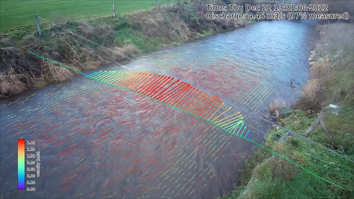

.. _plot_ug:

Plotting
========

*pyorc* offers a number of convenient plotting functions that allow you to summarize the output data into figures.
The plotting functionality is built such, that it can combine a view of a frame, with a view on your surface velocity
estimates, and transect velocities into one figure that displays all the steps of your processing in one single view.
The views can be made either in a ``camera`` perspective, providing an augmented reality view, a ``local`` perspective,
meaning the perspective after orthorectification, or a geographical perspectives, plotting on a geographical map if
the coordinate reference system is known. There may be use cases for all three perspectives. A full example of how to
establish a plot from our example dataset is shown below, with more information below that.

.. tab-set::

    .. tab-item:: Command-line

        To generate a plot through a recipe, you may include a ``plot`` section. In this section you can configure as
        many plots as you like in subsections. In the example, we only make one, called ``plot_quiver``.
        Under the ``plot_quiver`` examples, we specify 3 subsections ``frames``, ``velocimetry`` and
        ``transect`` to plot the respective components. Besides these subsections, you can specify a few other things:

        * ``mode``: select in what projection mode the plot should be made. This can be ``camera``, ``local`` or
          ``geographical`` as explained above. Try it out to see what this gives you.
        * ``reducer``: because plotting is only 2-dimensional, somehow you have to reduce the velocimetry results over
          the time dimension so that you only have the spatial dimensions left. This is done with a so-called ``reducer``
          operation. The available ones are ``mean`` and ``median``.
        * ``write_pars``: here you pass several parameters that may be used whilst writing to file. Please note that
          the available parameters are described in the ``matplotlib`` documentation, more specifically
          |savefig|. Only the parameter ``fname`` cannot be supplied as this is the filename for the output. This
          filename will be constructed by *pyorc* and has the naming convention ``<figure-name>.jpg``.

        .. literalinclude:: ./plot_example.yml
            :language: yaml

    .. tab-item:: API

        To generate a plot with all three components, you therefore need access to at minimum one frame from a
        ``pyorc.Frames`` object, a ``pyorc.Velocimetry`` object that is somehow reduced over time (e.g. a mean or median)
        and a ``pyorc.Transect`` object that has an effective velocity, perpendicular on the stream direction. Let's
        do a full example, starting with an already processed video. Below we re-open the video, also open the
        velocimetry results, retrieve a transect from it, and plot everything together in one figure. The
        specifics are explained after that.

        .. literalinclude:: ./plot_example.py
            :language: python

The resulting figure is shown below. Let's dive a little more into the details of the three different components.

.. image:: plot_example.jpg

Frames
------
.. tab-set::

    .. tab-item:: Command-line

        To plot a frame you only have to specify ``frames:`` without any further argument. Automatically, the first
        frame in the video will then be added to the figure.

    .. tab-item:: API

        The steps to get a frame plotted on your figure canvas, are the following:

        * get the frames from the video with ``get_frames``.
        * If you want to plot in ``local`` or ``geographical`` mode, then call ``frames.project`` on your ``Frames``
          object and move on with the result of this.
        * select a (one!) frame
        * call ``frames.plot`` on the result with your desired projection mode defined in the parameter ``mode``.
          By default ``mode="local"``. As you may note

        Note that in the example, we do the frame selection (with ``da_rgb[0]``) and plotting in one line of code as
        follows:

        .. code-block:: python

            p = da_rgb[0].frames.plot(mode="camera")

Velocimetry
-----------

Getting your 2-dimensional velocimetry results in the figure can be done in several ways with for each method
also other parameters that may be supplied. Below we describe briefly what the options are and we refer to the
respective web pages where the input parameters may be found (x and y being supplied by *pyorc* so you should not
supply these). For all methods, you can supply the parameters ``vmin`` and ``vmax``, which indicate the minimum and
maximum value you wish to show on a color scale. Furthermore, you may add an option ``add_colorbar: True`` to establish
a colorbar in the lower left corner. This colorbar will be bounded by the values supplied with ``vmin`` and ``vmax``.
If you do not supply ``vmin`` and ``vmax``, then the lowest and highest velocity value found will be used instead.
Note that any parameter added is not mandatory! If you leave the parameters out, then default values will be used
instead.

* quiver (default): "quivers" are arrows pointing into the vector direction, with the length and (possibly) color
  representing the scalar value of the velocity. See |quiver|. Especially the ``scale`` parameter is a little counter-
  intuitive. A **larger** value results in **smaller** arrows!!
* pcolormesh: this is a gridded colored mesh that defines the scalar values only. See |pcolormesh|.
* scatter: similar to pcolormesh, but then the velocities are represented by dots instead of grid cells. See
  |scatter|.
* streamplot: this only works on local mode and shows lines how particles would move over the surface. See
  |streamplot|.

.. tab-set::

    .. tab-item:: Command-line

        Within the recipe, under the selected plot (in the example ``plot_quiver``) and the ``velocimetry`` subsection
        you can define the plot method, and below that define the parameters. Please read the referred pages to see what
        options there are.

    .. tab-item:: API

        The plot methods are available under a subclass ``pyorc.Velocimetry.plot``. Before applying them, you must first
        reduce any time variable results over time, for instance with:

        .. code::

            # assume that processed and masked results are in piv
            piv_mean = piv.mean(dim="time", keep_attrs=True)

        .. note::

            The ``keep_attrs=True`` flag is quite important here as we may need the attributes to reproject data from
            the default x, y projection to the original camera perspective for instance.

        After reducing, we can use a set of methods to make plots, in a very similar manner as used for plotting
        frames. As shown in the example, you can smartly combine plots from a frame, with plots of your velocimetry results and by
        doing so create beautiful augmented reality views, or geospatial views. The different plotting method all use an
        underlying ``matplotlib.pyplot`` function and are also named accordingly. Hence they can receive keyword arguments
        specific to these underlying functions. In addition, the additional important keywords described above can be
        supplied as follows:

        * ``add_colorbar=True``: this flag will add a default colorbar to the axes
        * ``mode``: this flag can be set to ``local`` (default), ``geographical`` (for plots in a geospatial view) and
          ``camera`` for augmented reality in the camera's original perspective.

        Each plotting method always returns the mappable so that you can make your own colorbars, and refer to its parent axes
        and in turn the axes parent figure.

        The different plotting methods are summarised below.

        +----------------------------------------+---------------------------------------------------------------------------------+
        | Plot function                          | Description                                                                     |
        +========================================+================================================+================================+
        | ``pyorc.Velocimetry.plot.pcolormesh``  | computes scalar velocities and plots these as a gridded mesh                    |
        +----------------------------------------+---------------------------------------------------------------------------------+
        | ``pyorc.Velocimtry.plot.scatter``      | computes scalar velocities and plots as colored dots                            |
        +----------------------------------------+---------------------------------------------------------------------------------+
        | ``pyorc.Velocimetry.plot.streamplot``  | draws a streamplot through the x and y-directional velocities. Only works with  |
        |                                        | ``mode="local"``                                                                |
        +----------------------------------------+---------------------------------------------------------------------------------+
        | ``pyorc.Velocimetry.plot.quiver``      | draws a quiver plot using the x and y-directional velocities. If                |
        |                                        | ``pyorc.Velocimetry.plot`` is called directly, this method is used              |
        +----------------------------------------+---------------------------------------------------------------------------------+

Transect
--------

Plotting a transect is very similar to plotting of 2-dimensional velocimetry. Only the methods ``quiver`` and
``scatter`` are available, as streamplots and meshes do not apply to 1-dimensional datasets.

Another nice example of a augmented reality view over the Geul river in The Netherlands is shown below.

.. |savefig| raw:: html

   <a href="https://matplotlib.org/stable/api/_as_gen/matplotlib.pyplot.savefig.html" target="_blank">this page</a>

.. |pcolormesh| raw:: html

   <a href="https://matplotlib.org/stable/api/_as_gen/matplotlib.pyplot.pcolormesh.html" target="_blank">this page</a>

.. |scatter| raw:: html

   <a href="https://matplotlib.org/stable/api/_as_gen/matplotlib.pyplot.scatter.html" target="_blank">this page</a>

.. |quiver| raw:: html

   <a href="https://matplotlib.org/stable/api/_as_gen/matplotlib.pyplot.quiver.html" target="_blank">this page</a>

.. |streamplot| raw:: html

   <a href="https://matplotlib.org/stable/api/_as_gen/matplotlib.pyplot.streamplot.html" target="_blank">this page</a>
