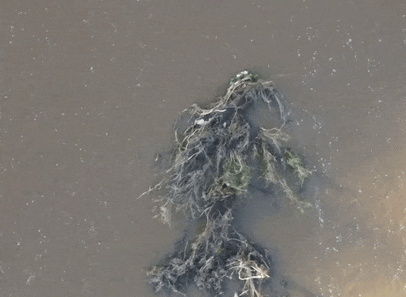

.. _video_ug:

Videos
======

Videos and video files are at the core of *pyorc*. Any analysis starts with a video file. Notably, these can be acquired
from different platforms, with suggestions given in the table below.

+----------------------------------+-----------------------------------------------------------------------------------+
| Platform                         | Use cases                                                                         |
+==================================+===================================================================================+
| Smartphone                       | Ad-hoc collection of data, e.g. during a flood.                                   |
|                                  | Permanent or temporary (e.g. for rating curve updates) and affordable observation |
|                                  | at one location that are orthorectified per video.                                |
|                                  | Permanent or temporary observations at one location with a fixed mould to         |
|                                  | keep a permanent stable objective.                                                |
+----------------------------------+-----------------------------------------------------------------------------------+
| Drone                            | Incidental observations e.g. to monitor velocity distribution around river        |
|                                  | restoration sites, new riverine infrastructure, sediment or waste trapping        |
|                                  | constructions or other environmental related uses.                                |
+----------------------------------+-----------------------------------------------------------------------------------+
| IP-camera                        | Permanent or temporary observations at measurement site without need for physical |
|                                  | presence. This requires a modem and power source. A power cycling setup is        |
|                                  | recommended to take videos in regular intervals.                                  |
+----------------------------------+-----------------------------------------------------------------------------------+
| Trap camera                      | Temporary observations at measurement site without need for physical presence,    |
|                                  | Ideal for wet season flow event capturing over a limited time until batteries     |
|                                  | run out or SD card is full. Typically uses AA batteries                           |
+----------------------------------+-----------------------------------------------------------------------------------+

.. tab-set::

    .. tab-item:: Command-line

        Whether you are setting up a camera configuration or processing a video into velocity products,
        a video must always be supplied using the option argument ``-V``. Within your
        recipe you can define several inputs to define further what should be done with the video. The example below
        demonstrates all inputs that currently can be supplied. The inputs define the start and end frame
        (``start_frame`` and ``end_frame``), the actual water level (``h_a``) in meters during the video, which will
        be compared against the water level taken with the video used for camera calibration.

        .. code-block:: yaml

            video:
              start_frame: 150
              end_frame: 250
              h_a: 92.23

    .. tab-item:: API

        *pyorc* therefore uses a so-called ``Video`` object to interrogate a video file, add understanding of video's
        perspective (using a ``CameraConfig`` object and the water level during which the video was taken)
        and define which frame range you wish to use to perform analysis on.

        Therefore you can pass a number of properties to a ``Video`` object so as to be able to work with it in *pyorc*.
        Please read the API section on the ``Video`` object to get details on how to create such a ``Video`` object. Some
        important properties are described below:

Camera configuration
--------------------

Essential for almost all steps after opening a video is to supply a :ref:`camera configuration <camera_config_ug>` with a video. This object contains
all information from the camera's lens characteristics, perspective, geographical awareness as derived from a sample
image or frame, with control point information in view.

.. tab-set::

    .. tab-item:: Command-line

        When processing for velocimetry, a camera configuration must be supplied through the
        option ``-c``, followed by the path to the file containing the camera configuration. If you do not yet have
        a camera configuration, then first go to the section on :ref:`camera configuration <camera_config_ug>` and
        construct a camera configuration with these guidelines.

    .. tab-item:: API

        As soon as you wish to work with the frames in the video
        (e.g. by calling the method ``get_frames``) you MUST specify a camera configuration. This is done through the
        argument ``camera_config`` with which you can either supply the path to a camera configuration file, stored
        on your disk, or an already loaded camera configuration. You may load a camera configuration in memory
        with the helper function ``pyorc.load_camera_config``. You can find more information on camera configurations,
        how to set these up in the :ref:`camera_config_ug` section.

The current water level
-----------------------
If you decide to take multiple videos of the same objective, for instance with a fixed camera rig, or with a smartphone
in a fixed rig, then you can reuse the camera configuration for each video. This is because as long as the perspective does
not change (i.e. you are looking at exactly the same scene from the same location) then also the camera configuration
can remain exactly the same. This is ideal for gathering time series, for instance to interpret river flow during an
event or for permanent video observations of river flow. Per video, there is only one thing that must be provided. This
is the present water level. This can be provided in a locally selected datum (e.g. the level as read from a staff gauge)
and will be related to the water level, as read during the survey, used to construct the camera configuration.

.. tab-set::

    .. tab-item:: Command-line

        You can supply the "current" water level with the ``-h`` (short) or ``--h_a`` (long) option. You can also insert the
        water level in the recipe yaml (although this is less practical mostly). The example below will process a video
        with a water level reading of 92.23 meters. If you do not supply it, ``pyorc`` will assume the water level is
        the same as in the control video. With incidental observations (e.g. with a drone survey), the video used to
        setup the camera configuration and video processed here will be the same, and in this case you can simply leave
        out the current water level.

        .. code-block:: yaml

            video:
              h_a: 92.23

    .. tab-item:: API

        The "current" water level (i.e. commensurate with the situation in the video you are currently processing) can
        be set by passing the argument ``h_a`` upon creating a ``Video`` object, e.g.

        .. code-block:: python

            import pyorc
            video_file = "../examples/ngwerere/ngwerere_20191103.mp4"
            video = pyorc.Video(video_file, camera_config=cam_conf_file, h_a=92.23)

.. note::

   To guarantee that the perspective does not change, the following conditions MUST be met:

       * The same lens must be used as used for the control image of the camera configuration. Note that smartphones often
         have multiple lenses e.g. for wide angle versus close-ups. Ensure you have zoom level at the same level as used
         for the control image and do not use digital zoom! It generally only reduces image quality.
       * The camera must be placed at exactly the same location and oriented to exactly the same objective
       * The camera's resolution and other settings must be exactly the same as during the control image.

Frame range
-----------
You may have recorded a relatively long video and only wish to process a subset of frames. This can be controlled by
providing a start frame and end frame.

.. tab-set::

    .. tab-item:: Command-line

        You may select a start and end frame in the recipe by providing ``start_frame`` and ``end_frame`` in the video
        section. The example below will process from frame 150 until frame 250.

        .. code-block:: yaml

            video:
              start_frame: 150
              end_frame: 250
              h_a: 92.23

    .. tab-item:: API

        Start and end frames can be provided with the ``start_frame`` and ``end_frame`` arguments.
        If you set this to an integer larger than 0 and smaller than the maximum frames available, then only the frames
        in between will be processed.

Stabilization
-------------
.. note::

    Video stabilization is still experimental. Please raise an issue on Github with a link to a video if you experience
    issues.

Videos may be taken in unsteady conditions. This may happen e.g. with slight movements of a smartphone, a
drone that has varying air pressure conditions or wind gusts to deal with, or even fixed cameras in strong winds. But
also, someone may have taken an incidental video, that was not originally intended to be used for river flow and velocity
observations, but may render important information about a flood. For this the ``stabilize`` option can be passed with
a stabilization strategy as input. The stabilization may already be set during the camera configuration and this is
in most cases the recommended approach. You may also arrange stabilization per video, and then supply a list of
[column, row] coordinates in the recipe. With this option, each frame will be stabilized with respect to the start frame chosen by the user
(through the option ``start_frame``).

.. note::

    Currently we don't yet have an interactive functionality to provide the mask exterior. We will establish this
    in forthcoming updates so that the ``mask_exterior`` can already be defined in the camera configuration with
    a few mouse clicks.

.. table:: Small part of 4K drone footage in Rio Grande - Brazil, showing left: no stabilization applied; right:
           stabilization applied with ``stabilize="fixed"``. The algorithm automatically detects rigid points on river
           banks but also on the debris showed in this subscene.

    +-----------------------------------------------------------+----------------------------------------------------------+
    | Unstable                                                  + Stable                                                   |
    +===========================================================+==========================================================+
    | |videounstab|                                             | |videostab|                                              |
    +-----------------------------------------------------------+----------------------------------------------------------+

.. tab-set::

    .. tab-item:: Command-line

        Add the ``stabilize`` option in the recipe with the name of the stabilization strategy as argument. Below, a
        full example is provided including a set of coordinates that bounds the water surface. These are provides as
        [column, row] pairs under the ``mask_exterior`` option.

        .. code-block:: yaml

            video:
              start_frame: 150
              end_frame: 250
              h_a: 92.23
              stabilize: [[816, 2160], [744, 0], [3287, 0], [3374, 2160]]

    .. tab-item:: API

        A working example to obtain a stabilized video from our example section is provided below.

        .. code::

            import pyorc

            # set a video filename below, change to your own local file location
            video_file = "examples/ngwerere/ngwerere_20191103.mp4"
            # point to a file containing the camera configuration
            cam_config = pyorc.load_camera_config("examples/ngwerere/ngwerere.json")
            video = pyorc.Video(
                video_file,
                camera_config=cam_config,
                start_frame=0,
                end_frame=125,
                stabilize=[[150, 0], [500, 1080], [1750, 1080], [900, 0]]
            )
            video

        .. note::

            If you choose to only treat a very short part of a video such as only one second, then it may be difficult for the
            stabilizing functions to distinguish rigid points from non-rigid. In this case we recommend to set ``start_frame``
            and ``end_frame`` to cover a larger time span, and then make a sub-selection after having retrieved the frames
            from the video. This will not be significantly slower, because *pyorc* utilizes a lazy programming approach and
            will then only load and process the frames you select afterwards.

            .. code-block:: python

                # start with a large frame set for detecting rigid points
                video = pyorc.Video(fn, start_frame=0., end_frame=200)
                # get your frames, and only the first 30
                da_frames = video.get_frames()[0:30]
                # do the rest of your work

.. |videostab| image:: ../../_images/video_stable.gif
   :scale: 80%
   :align: middle

Getting frames
--------------

When your video object is setup with a :ref:`camera configuration <camera_config_ug>`, optional stabilization,
and start and end frame, then extracting frames, and working with these to sharpen features, reproject and store these
becomes very easy.

.. tab-set::

    .. tab-item:: Command-line

        Frames will be extracted automatically when a ``frames`` section is available in the recipe. More on the use of
        frames can be found in :ref:`frames section <frames_ug>`

    .. tab-item:: API

        To extract all frames, you only need to call ``video.get_frames()``. This will five you grayscale
        frames, in a ``xr.DataArray`` object. The structure of this object follows a specific data model for frames, and
        therefore, methods that work on sets of frames can be applied, as described in the next section on :ref:`frames`.

